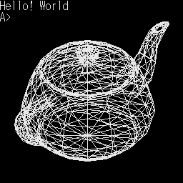

# elf2x68k XDF/HDF Sample

[English](README.md) | [ì˙ñ{åÍ](README.ja.md)

<p align="center">
  
</p>

<p align="center">
  <strong><a href="https://uraraworks.github.io/WebX68k/?cpu=100&ram=12&hdd=https%3A%2F%2Fraw.githubusercontent.com%2Frenatus-novus-x%2Felf2x68k-xdf-sample%2Frefs%2Fheads%2Fmain%2Fimages%2Fteapot.zip&run=1">? Run the teapot sample instantly in WebX68k</a></strong>
</p>

A small collection of Makefile examples for building X68000 programs with [elf2x68k](https://github.com/yunkya2/elf2x68k) and packaging them into bootable Human68k disk images.

The repository demonstrates two simple workflows:

- `samples/hello` ? build a minimal program into a bootable **XDF floppy image**.
- `samples/teapot` ? build a wireframe OBJ viewer and model into a bootable **SASI HDF hard-disk image**.

Both samples automatically download the official Human68k 3.02 distribution, use [XDFtool](https://github.com/yunkya2/x68kmisc/tree/main/xdftool) to rebuild the disk image, and patch `AUTOEXEC.BAT` so the sample starts automatically after Human68k boots.

## Repository layout

```text
.
Ñ•ÑüÑü README.md
Ñ•ÑüÑü README.ja.md
Ñ•ÑüÑü images/
ц   Ñ•ÑüÑü teapot.png
ц   ѧÑüÑü teapot.zip
ѧÑüÑü samples/
    Ñ•ÑüÑü hello/
    ц   Ñ•ÑüÑü Makefile
    ц   ѧÑüÑü hello.c
    ѧÑüÑü teapot/
        Ñ•ÑüÑü Makefile
        Ñ•ÑüÑü model.obj
        ѧÑüÑü teapot.c
```

## Quick demo with WebX68k

The prebuilt teapot image can be launched directly in [WebX68k](https://uraraworks.github.io/WebX68k/) without installing a local emulator or toolchain:

**[? Run teapot.zip in WebX68k](https://uraraworks.github.io/WebX68k/?cpu=100&ram=12&hdd=https%3A%2F%2Fraw.githubusercontent.com%2Frenatus-novus-x%2Felf2x68k-xdf-sample%2Frefs%2Fheads%2Fmain%2Fimages%2Fteapot.zip&run=1)**

The link loads `images/teapot.zip` as an HDD image and starts it automatically.

## Requirements

The Makefiles are intended for Linux environments such as Ubuntu 24.04 LTS, including Ubuntu running under WSL2.

### elf2x68k

Install [elf2x68k](https://github.com/yunkya2/elf2x68k) first and make sure the cross compiler is available in `PATH`:

```sh
m68k-xelf-gcc --version
```

### Host tools

Install the required tools on Ubuntu:

```sh
sudo apt update
sudo apt install make curl unar python3
```

`unar` is used to extract the official Human68k LZH archive while interpreting its Japanese filenames as Shift_JIS. The file contents themselves are not character-code converted.

## Sample 1: bootable XDF floppy image

The `samples/hello` directory is the smallest example.

```sh
cd samples/hello
make
```

It builds:

```text
hello.x
hello.xdf
hello.zip
```

The Makefile:

1. compiles `hello.c` with `m68k-xelf-gcc`,
2. downloads the official Human68k 3.02 archive,
3. extracts `HUMAN302.XDF`,
4. extracts the files from the original Human68k floppy with `xdftool.py`,
5. copies `hello.x` into the disk,
6. appends `hello.x` to `AUTOEXEC.BAT`,
7. rebuilds a bootable 1232 KB X68000 XDF image, and
8. creates `hello.zip` containing the generated image and the original Human68k permission text.

The resulting boot sequence is:

```text
X68000 boot
    Å´
Human68k
    Å´
AUTOEXEC.BAT
    Å´
hello.x
```

To inspect the generated image:

```sh
make check-xdf
```

## Sample 2: bootable SASI HDF image

The `samples/teapot` directory demonstrates the same idea with a larger program and data file that are better suited to a hard-disk image.

```sh
cd samples/teapot
make
```

It builds:

```text
teapot.x
teapot.hdf
teapot.zip
```

`teapot.hdf` is a **10 MB SASI Human68k hard-disk image** created by XDFtool using its `/h10` format.

The generated HDF contains both:

```text
teapot.x
model.obj
```

The Makefile patches `AUTOEXEC.BAT` to run:

```text
teapot.x model.obj
```

so the teapot is displayed automatically after Human68k boots.

To inspect the generated image:

```sh
make check-hdf
```

## Teapot sample

The teapot sample is a deliberately small Wavefront OBJ wireframe viewer for Human68k.

It initializes the X68000 graphics screen with IOCS:

```c
_iocs_crtmod(0x0e);
_iocs_g_clr_on();
```

and draws the model edges with:

```c
_iocs_line(&param);
```

The OBJ model is centered and scaled to fit the graphics screen automatically. The program does not require OpenGL or MiniGL at runtime; drawing is performed directly through X68000 IOCS calls.

The OBJ loading and wireframe approach are related to the techniques used in [miniglut-x68k](https://github.com/renatus-novus-x/miniglut-x68k), while this repository keeps the sample intentionally compact and focused on disk-image generation with elf2x68k.

## How the image build works

Both samples follow the same basic process:

```text
C source
   ц
   ц m68k-xelf-gcc
   Å•
Human68k .x executable

HUMN302I.LZH
   ц
   ц unar -e shift_jis
   Å•
HUMAN302.XDF
   ц
   ц xdftool.py x
   Å•
Human68k files
   ц
   Ñ•ÑüÑü add application files
   Ñ•ÑüÑü patch AUTOEXEC.BAT
   ц
   ѧÑüÑü xdftool.py c
          ц
          Ñ•ÑüÑü XDF floppy image
          ѧÑüÑü SASI HDF hard-disk image
```

Human68k itself is **not stored as source material in the sample directories**. The Makefiles obtain the official Human68k 3.02 archive when needed.

## Human68k distribution terms

The Makefiles download Human68k 3.02 from the official X68000 LIBRARY distribution:

```text
http://retropc.net/x68000/software/sharp/human302/HUMN302I.LZH
```

The permission text included in the original archive is copied byte-for-byte and included in each generated distribution ZIP.

Please read and follow those terms when redistributing generated disk images containing Human68k.

## XDFtool

Disk-image manipulation is performed with `xdftool.py` from:

https://github.com/yunkya2/x68kmisc/tree/main/xdftool

The Makefiles download a pinned revision of `xdftool.py` automatically, so a separate XDFtool installation is not required.

XDFtool supports both standard X68000 floppy images and SASI hard-disk images.

## Cleaning

Inside either sample directory:

```sh
make clean
```

removes the generated executable and disk/archive files while preserving downloaded support files.

To remove downloads and intermediate files as well:

```sh
make distclean
```

## References

- [elf2x68k](https://github.com/yunkya2/elf2x68k)
- [elf2x68k-sample](https://github.com/yunkya2/elf2x68k-sample)
- [XDFtool / x68kmisc](https://github.com/yunkya2/x68kmisc/tree/main/xdftool)
- [WebX68k](https://uraraworks.github.io/WebX68k/)
- [Human68k 3.02](http://retropc.net/x68000/software/sharp/human302/)
